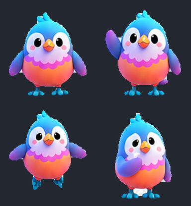

# MomoBird — Codex 桌面宠物

彩色圆润的小鸟吉祥物，按 Codex 宠物精灵图（sprite sheet）规范打包，可直接放进 `~/.codex/pets/` 使用。



## 文件清单

| 文件 | 说明 |
| --- | --- |
| `pet.json` | 宠物清单（manifest），Codex 靠它识别宠物 |
| `spritesheet.webp` | **正在使用的精灵图**，v2 规格，1536×2288，8 列 × 11 行 |
| `spritesheet.png` | v1 时期的旧图（9 行 / 1536×1872），仅作存档，运行时不加载 |
| `preview.png` | 静态预览图 384×416，用于 README / 画廊展示 |
| `build_spritesheet.py` | 早期把生成的原画切成 v1 网格的打包脚本（见下方说明） |
| `idle.webp` / `waiting.webp` / `look-around.webp` | 单个动作的动图，只用于展示，不参与加载 |

`pet.json` 的内容：

```json
{
  "displayName": "MomoBird",
  "description": "彩色 MomoBird 动画宠物",
  "spriteVersionNumber": 2,
  "spritesheetPath": "spritesheet.webp",
  "id": "momobird"
}
```

`spritesheetPath` 是**相对于 `pet.json` 所在目录**的路径，所以两个文件必须放在同一层。

## 一、安装（拿到 zip 的人这样做）

```bash
mkdir -p ~/.codex/pets/momobird
unzip momobird.zip -d ~/.codex/pets/momobird/
```

解压后目录应该长这样（`pet.json` 和 `spritesheet.webp` 直接在 `momobird/` 下，**不要多套一层目录**）：

```
~/.codex/pets/momobird/
├── pet.json
├── spritesheet.webp
├── preview.png
└── ...
```

检查一下：

```bash
ls ~/.codex/pets/momobird/
cat ~/.codex/pets/momobird/pet.json
```

然后重启 Codex 桌面应用，在宠物选择界面里就能看到 MomoBird。

> 目录名建议和 `pet.json` 里的 `id` 保持一致（`momobird`），换个名字容易和别人的宠物撞车。

## 二、打包分发（作者这样做）

最省事的方式就是打 zip 直接发给对方（微信 / 邮件 / 网盘都行）：

```bash
cd ~/.codex/pets/momobird
zip -r ~/momobird.zip pet.json spritesheet.webp preview.png -x '.*' -x '__MACOSX/*'
```

几个坑：

- macOS 的 `zip -r .` 会把 `.DS_Store` 和 `__MACOSX/` 一起塞进去，对方解压后会多出一堆垃圾文件（当前仓库根目录那个 `momobird.zip` 就有这个问题）。上面的命令显式列文件并加 `-x` 排除。
- 只发 `pet.json` + `spritesheet.webp` 就够跑了，加上 `preview.png` 是为了对方能先看一眼。`spritesheet.png` 是旧版本，1.7 MB，没必要发。
- 压缩包里**不要**再包一层 `momobird/` 目录，否则对方解压到 `~/.codex/pets/momobird/` 会变成 `~/.codex/pets/momobird/momobird/pet.json`，Codex 找不到。

## 三、社区里的其他分发流派

目前 Codex 界面没有"导入 / 导出宠物"的按钮，`codex` CLI 也没有 `pet` 子命令 —— **所有分发方式本质上都是把文件拷到 `~/.codex/pets/<id>/`**，区别只在于谁来执行这个拷贝动作。

### 1. zip 直接发（本仓库采用）

优点：零依赖、离线可用、对方看得见自己装了什么。缺点：更新要重新发一遍。适合小范围分享。

### 2. GitHub 仓库 + `curl | sh` 安装脚本

往仓库里放 `pet.json` + `spritesheet.webp`，再配一个安装脚本，对方一行命令搞定：

```bash
curl -fsSL https://raw.githubusercontent.com/<user>/<repo>/main/install.sh | sh
```

`install.sh` 大致是这样：

```sh
#!/bin/sh
set -eu
REPO="https://raw.githubusercontent.com/<user>/<repo>/main"
DEST="${CODEX_HOME:-$HOME/.codex}/pets/momobird"
mkdir -p "$DEST"
for f in pet.json spritesheet.webp preview.png; do
  curl -fsSL "$REPO/$f" -o "$DEST/$f"
done
echo "MomoBird 已安装到 $DEST，重启 Codex 生效"
```

优点：更新只要推一次 commit，装的人重跑一遍命令就行；仓库本身还能当展示页。缺点：让人 `curl | sh` 执行你的脚本，是要对方信任你的 —— 体面的做法是在 README 里把脚本内容贴出来，并同时给出"手动下载两个文件丢进目录"的备选路径。

### 3. 提交到公开宠物画廊

社区维护的宠物合集仓库，提 PR 把自己的宠物加进去，别人从画廊里挑着装。优点：有曝光、有人帮你审规格。缺点：要等合并，规范（命名、预览图尺寸、许可证）得按人家的来。

## 四、精灵图规格（v2）

改图或者自己做一只的时候按这个来：

- 整图 **1536 × 2288**，RGBA（带透明通道），`.webp` 或 `.png`
- 网格 **8 列 × 11 行**，每格 **192 × 208**
- 每格四边留透明边距（约 x 18px / y 16px），角色不要顶到格子边缘
- 一行里用不到的格子必须**完全透明**

行与动作状态的对应关系：

| 行 | 状态 | 帧数 | 用途 |
| --- | --- | --- | --- |
| 0 | `idle` | 6 | 静止呼吸、眨眼循环 |
| 1 | `running-right` | 8 | 向右拖动时的移动循环 |
| 2 | `running-left` | 8 | 向左拖动时的移动循环 |
| 3 | `waving` | 4 | 打招呼 / 吸引注意 |
| 4 | `jumping` | 5 | 悬浮或跳跃 |
| 5 | `failed` | 8 | 被拦截、失败、取消时的反应 |
| 6 | `waiting` | 6 | 等待授权 / 等用户输入 |
| 7 | `running` | 6 | 正在干活 / 处理中 |
| 8 | `review` | 6 | 结果就绪、等待查看 |
| 9 | `look-row-9` | 8 | 朝向 0°→157.5°（正上顺时针到右下） |
| 10 | `look-row-10` | 8 | 朝向 180°→337.5°（正下顺时针到左上） |

第 9、10 行合起来是 16 个朝向，每 22.5° 一帧，用来做"跟着鼠标看"的效果。

`pet.json` 里的 `spriteVersionNumber` 必须和精灵图的规格版本对上：**v2 = 11 行 / 2288 高**。写成 `1` 但给了 11 行的图，会按 9 行的老网格去切，动画会错位。

## 五、关于 `build_spritesheet.py`

这个脚本属于 **v1 时期**的产物：它从一张 `~/.codex/generated_images/...` 下的原始生成图里按固定坐标切格子、抠背景（连通域 + 洪水填充去掉连到边缘的中性色像素）、统一缩放，最后拼成 9 行的 `spritesheet.png` 并写出 v1 的 `pet.json`。

留着是为了记录抠图和校验的思路（尾部那段 assert 会检查尺寸、透明边距、空格子），**但它不能用来重新生成当前的 `spritesheet.webp`**：

- 它写死了本机一个已经不存在的源图路径
- 它按 9 行 / 1872 高输出，和现在的 v2（11 行 / 2288 高）不一致
- 它会把 `pet.json` 覆盖回 `spriteVersionNumber: 1` + `spritesheetPath: spritesheet.png`

要跑的话先改掉 `SOURCE`、`ys`、`counts` 和结尾的 manifest。依赖是 `pillow` 和 `numpy`。

---

**注意**：当前仓库工作区里 `pet.json`、`spritesheet.webp`、`spritesheet.png`、`preview.png`、`build_spritesheet.py` 这几个文件已被暂存（staged）但在工作区里被删掉了 —— 内容还在 git 索引和 `~/.codex/pets/momobird/` 里。提交前先 `git checkout -- .` 把它们恢复回来，否则这次提交会把它们一并删除。
